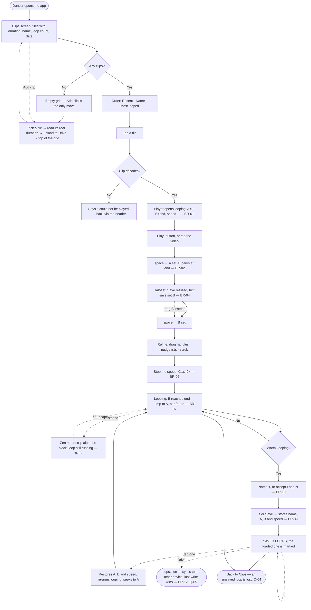

# UC-01: Loop a section of a clip

**Status:** Draft
**Derived from:** the mockup at `mockup/src`, running on `localhost`, on 2026-08-31 (#2)

> **How this was derived, and where its rules get settled.** The method
> (`use_case_plan.md` → *Deriving a UC from the mockup*) is a walkthrough in which
> the author opens the live page and narrates it. This document was produced by an
> **agent-driven** walkthrough instead: both screens were opened and read in a real
> browser, not inferred from source. That covers the surfaces — what is on screen,
> how it is labelled, what state it starts in — and it does **not** cover live
> playback, because the clip never decoded in the automated tab (See *Exception
> Flows*, 6a). The rules governing playback were therefore read off the mockup's
> code, and are marked 🔍 below.
>
> **The upfront walkthrough is not going to happen, and does not need to** (See
> Q-01). Every story cut from this use case is reviewed and editable before it is
> accepted for implementation, so a 🔍 rule gets settled by the author at the moment
> it actually matters — when the story that rests on it is accepted — rather than
> in one sitting beforehand. The marks are a worklist for that review, not a warning
> about the document.

**Surfaces:** the Clips screen (`mockup/src/Library.jsx`) and the player
(`mockup/src/Player.jsx`). The mockup switches between them by state; the product
has no URLs to preserve either.

## Brief Description

**Starts with:** Dancer opens the app wanting to learn a specific few seconds of a
clip they have already added.

**Ends with:** Dancer has framed those seconds as an A/B loop at a speed they can
follow, has practised against it, and — where it was worth coming back to — has
kept it under a name.

---

## Actors

| Actor | Role |
|-------|------|
| **Dancer** (Primary) | The single user. The same person on a laptop at home and on a phone in a studio; there are no roles, no accounts other than their own Google account, and nobody else ever sees this data |
| Google Drive | External system — the storage layer. Holds the clips and the saved loop points, and is the only reason the two devices agree (See BR-12) |
| Google OAuth | External system — issues the hourly access token the Drive calls are made with (See BR-14) |

_There is deliberately **no server actor**. The app is a static page; if a flow
below appears to need a backend, that is a finding to report, not a component to
add (CLAUDE.md → Constraints)._

---

## Pre-Conditions

1. Dancer has authorised the app against their Google account, and a valid access
   token is held
2. At least one clip has been **uploaded through the app itself** — a file dropped
   into the Drive folder by hand is invisible to it (See BR-11)
3. The static site has loaded

_A first-run dancer with no clips still reaches the Clips screen; it is the surface
the first upload starts from (See 2a)._

---

## Basic Flow

### Choosing a clip

1. Dancer opens the app
2. System displays the **Clips** screen: a heading, an **Add clip** action, three
   ordering chips, and a responsive grid of clip tiles — two columns on a phone,
   four on a wide laptop
3. System draws each tile as a portrait (9:16) poster frame with the clip's
   **duration** in its bottom-right corner, and beneath it the clip's **name**, the
   **count of loops saved against it** in parentheses where there are any, and the
   **date it was added**
4. Dancer optionally re-orders the grid: **Recent** (the default), **Name**, or
   **Most looped**
5. Dancer taps a tile
6. System opens the player on that clip

### Framing the section

7. System loads the clip and starts it in a known state: the loop spans the
   **whole clip** (A at 0, B at the end), **looping is already on**, and speed is
   **1** (See BR-01)
8. Dancer plays the clip — by the **PLAY** button, or by tapping the video itself
9. Dancer presses **space** as the section begins; System sets **A** to the current
   time and parks **B** at the end of the clip, so what is on screen is still a
   valid loop (See BR-02)
10. Dancer presses **space** as the section ends; System sets **B** to the current
    time. Further presses alternate A, B, A… and the on-screen hint always names
    which one is next (See BR-03)
11. Dancer refines the boundaries by any of: dragging the **A** or **B** handle
    along the track — or, with a handle focused, the **arrow keys** — nudging the
    playhead **±1 second**, or tapping the track to scrub

### Slowing it down

12. Dancer steps the speed down with **−** (0.05 at a time) or **−−** (0.1 at a
    time), reading the current rate off the value between them
13. System applies the new rate to playback immediately, without interrupting the
    loop (See BR-06)

### Practising

14. With looping on, System returns playback to **A** every time it reaches **B**,
    and keeps doing so until told otherwise (See BR-07)
15. Dancer may press **START** to jump back to A without leaving the loop, or
    **LOOPING** to release the loop and let the clip run on
16. Dancer optionally enters **zen mode** — the **f** key, or the expand control on
    the video — and System hides every control, putting the clip alone on black at
    the largest size the viewport allows. **The loop keeps running** (See BR-08)

### Keeping the loop

17. Dancer types a name for the loop, or leaves the field empty to accept the
    offered **Loop N**
18. Dancer presses **s**, or **Enter** with the caret still in the name field, or
    the **Save** button — three routes through one guard (See BR-04)
19. System appends the loop to **SAVED LOOPS**, storing its **name, A, B and
    speed** — the speed is part of the loop, not a separate setting (See BR-09)
20. System lists each saved loop with its name and its `A – B · Nx` summary, and
    **marks the one currently loaded** so the dancer can see where they are
21. Dancer recalls a saved loop by tapping it; System restores A, B **and speed**,
    turns looping back on, and seeks to A
22. Dancer removes a saved loop with its **×**

### Leaving

23. Dancer returns to the Clips screen via **Clips** in the header

---

## Alternate Flows

### 2a: First run, no clips
- At step 2, the grid is empty and the only meaningful action is **Add clip**. The
  screen carries the standing explanation that clips live in Google Drive and that
  the app only sees files it uploaded itself (See BR-11).

### 4a: Add a clip (Any step on the Clips screen)
- Dancer chooses **Add clip** and picks a video file.
- System reads the file's **real duration** before listing it, so the new tile
  carries a true length rather than a placeholder, adds it to the top of the grid,
  and switches the ordering to **Recent** so the clip just added is where the eye
  already is.
- In the product this is where the **Drive upload** happens (See BR-11, Q-07).

### 9a: Half a loop (Framing)
- Between the space that sets A and the space that sets B, B is still parked at the
  end of the clip. **Save is refused** — the button is disabled and the hint reads
  *"set B to finish the loop"* — because saving here would store a boundary nobody
  chose (See BR-04).
- Flow continues from step 10.

### 11a: Finishing a half-set loop by hand (Framing)
- At step 11, moving the **B** handle — dragging it, or pressing its arrow keys —
  completes a loop that space left half-set, and re-arms space to set **A** next.
  The two ways of setting the points are one state, not two (See BR-03). Extended
  to the arrow keys at US-01-10's approval gate, 2026-09-03: both routes go through
  the slider's own change, so a distinction would have to be invented to keep them
  apart.

### 16a: Leaving zen mode
- **Escape** or the close control returns the controls. **f** toggles.

### *a: Typing suppresses the shortcuts (Any step in the player)
- While the caret is in the loop-name field, **space**, **s** and **f** type
  characters rather than firing their shortcuts — otherwise a loop could not be
  named "space fix" without re-framing it (See BR-05).

---

## Exception Flows

### 6a: The clip does not decode
- At step 6, if the browser cannot decode the clip, the player still opens, but in
  place of the clip **System states plainly that it could not be played**. The
  header's **Clips** link is the way back; nothing else is offered, and no retry is
  attempted.
- The silent version of this — duration stuck at `00:00`, the handles on top of each
  other, the track inert, **Save offering `00:00 – 00:00`** — is what the *mockup*
  does, and was observed directly during this derivation, where Chrome declined to
  decode in a non-foreground tab. It is reachable in ordinary use, not only in
  automation, and the Drive download path makes a failed or partial fetch likelier
  still. It was reached by accident rather than chosen, so the product departs from
  the mockup here (See Q-02, US-01-06).

### *b: The access token expires
- Roughly hourly, and no backend-less app can do better. The spike settled that
  renewal is triggered on user-initiated sync rather than lazily at expiry, so the
  interruption lands at a natural break instead of mid-move (See BR-14).

### *c: No connectivity
- A studio with bad signal is the expected case, not the edge case. Anything
  already cached must keep working (See BR-13).

---

## Post-Conditions

**Success:**
1. The section the dancer wanted is framed as an A/B loop at a chosen speed
2. Where the dancer saved it, the loop persists against that clip with its name, its
   boundaries and its speed, and is available on their other device (See BR-12)
3. The clip itself is unchanged — nothing here edits video

**Abandoned:**
1. An unsaved loop is lost on leaving the player. Nothing is auto-saved, and the
   dancer is not warned (See Q-04)

---

## Supplemental Requirements

### Business Rules

> Those marked 🔍 were read off the mockup's code rather than watched on screen.
> They are confirmed or overturned by the author when the story that rests on them
> is accepted for implementation (See Q-01) — so a 🔍 is a question to answer at
> that moment, not a rule to distrust in the meantime.

| ID | Rule |
|----|------|
| BR-01 | **The player opens ready to loop.** Looping is on, and A/B span the whole clip, so pressing play immediately does the thing the app is for. Nothing has to be armed first |
| BR-02 | **B parks at the end of the clip when A is set.** Setting A alone would otherwise leave B behind the playhead and the loop invalid. Parking keeps every intermediate state playable. Confirmed at US-01-10's approval gate, 2026-09-03, 🔍 cleared |
| BR-03 | **Space sets the loop points, and deliberately is *not* play/pause.** Setting A and B is what the dancer does *while watching*, so it earns the most reachable key; play is reachable three other ways (the button, the video itself, and the space that most video players would have used). Presses cycle A, B, A… **Confirmed against real use at US-01-10's approval gate, 2026-09-03, 🔍 cleared** — the bet on overriding the habit was tested by framing loops in the mockup for real, and it holds |
| BR-04 | **Half a loop is not a loop.** Between A and B being set, saving is refused — in the button *and* in the keyboard shortcut, so the two cannot disagree. Confirmed at US-01-10's approval gate, 2026-09-03, 🔍 cleared. The single guard the rule demands is the half-set state introduced by US-01-10 and read by US-01-11's button and key alike |
| BR-05 | **Shortcuts yield to typing.** Space, s and f do nothing while a text field has the caret. Confirmed at US-01-10's approval gate, 2026-09-03, 🔍 cleared — one gate at the top of the key handler, so a key binds under it rather than beside it |
| BR-06 | **Speed runs 0.1x to 2x**, stepped by 0.05 and 0.1. The floor matters more than the ceiling: 0.25x is roughly where a fast turn becomes readable, and the range has to go below it. **Confirmed** at US-01-09's approval gate (#25), 🔍 cleared: the range stands as mocked, with the bottom of it accepted as probably dead travel rather than defended — nothing is lost by offering it, and it can be raised later without breaking anything |
| BR-07 | **The loop is enforced per animation frame, not on the video's own progress events**, which fire at about 4 Hz — far too coarse for a two-second loop, where it would overshoot visibly. The spike measured 86 ms worst-case overshoot on a tight 2 s loop. **Settled at US-01-07's approval gate, with one change from the mockup: the callback runs only while playing *and* looping.** The mockup subscribes once and never stops, which is the battery cost this rule used to carry as an open question; a paused clip has no overshoot to correct, so gating it costs nothing in tightness and answers the question by removing the cost. `requestVideoFrameCallback` is the better instrument and was declined — Firefox does not implement it, so it needs an rAF fallback that nobody would exercise. **Extended at US-01-08's approval gate, 2026-09-03: the playhead marker on the loop slider is sampled the same way, and for the same reason** — 4 Hz is as visible in a marker that jerks as it is in a loop that overshoots. It is a *second* rAF rather than a share of this one, because this one is gated on looping as well as playing and the playhead has to keep moving after the loop is released |
| BR-08 | **Zen mode restyles the player; it never rebuilds it.** Moving the video element in the page would remount it, reloading the clip and losing the position being watched. Same element, different appearance — and the loop keeps being enforced throughout. The controls are hidden rather than unmounted, for the same reason. Confirmed at US-01-12's approval gate, 2026-09-03, and given a criterion of its own there so the constraint is checked rather than inferred |
| BR-09 | **A saved loop is `{ name, A, B, speed }`.** Speed is part of what was saved, not a global preference: recalling a loop restores the tempo it was learned at |
| BR-10 | **Loops are named, and naming is optional.** An unnamed loop takes the offered `Loop N`. A clip typically earns a few, so they need to be told apart. **Settled at US-01-11's approval gate, 2026-09-03: N is the lowest number not already taken**, read off the names currently saved. The mockup offers `saved.length + 1`, which collides after a removal — save three, delete two, and the next offer is a name already on the list. A monotonic counter avoids that and gaps instead, and resets on reload, so once US-01-15 restores loops from Drive it would start at 1 and collide anyway. Lowest-unused is the only one of the three that survives both a removal and a reload |
| BR-11 | **Every clip must be uploaded through the app.** The Drive scope is `drive.file`, which sees only files the app itself created — a file placed in the folder by hand is not restricted, it is *invisible*. The broader scopes are restricted and would need a Google security assessment, so this is settled |
| BR-12 | **The loops are the asset, and they sync.** Clips plus their loop points live in Drive, which is what makes marking up a section at home and finding it on the phone in the studio the same act. **Settled at US-01-15's approval gate, 2026-09-04:** `loops.json` is **read-modify-write per change**, not last-write-wins. Every save or removal re-reads the file and applies only that one change — append this loop, drop this id — so a loop written on the other device since this clip was opened survives. Because the operations are that small the merge falls out of the shape and no tombstone is needed; Drive's `version` field guards the ~200 ms left between the read and the write, and a version that moved means retry rather than clobber. The file is keyed on the app's own `clipId`, which `clipIdFor` derives from the file itself, so a clip re-uploaded finds its loops again. **A `loops.json` that will not parse is refused rather than overwritten** — the one failure mode that would destroy the asset instead of merely failing to add to it (See Q-05, and Q-06 for the export that is still wanted) |
| BR-13 | **Cache-first.** A ~9 MB clip takes about 7 s to download before it plays. Caching turns that into once per clip, covers a hall with bad signal, and absorbs the hourly token renewal — one decision paying three ways. **Settled at US-01-16's approval gate, 2026-09-03:** the bytes live in **IndexedDB** behind an injected seam (not the Cache API, which has nowhere to keep the bookkeeping a budget needs; and no backend is involved either way — BR-14 stands), bounded by a **500 MB budget with the least-recently-opened evicted first**, and the cache is consulted **before** the token rather than after. That ordering is what makes the third payoff real: `requireToken` renews through the sign-in popup, so asking it first would flash one on a clip that needed no network, and would fail outright offline. The cache is deliberately never a store of record — WebKit clears script-writable storage after about a week away, which costs a re-download and nothing more |
| BR-14 | **No backend, and no serverless function.** The app is a static page on GitHub Pages. If something appears to require a server, that is a finding to report rather than a thing to build |
| BR-15 | **The app never touches Instagram.** Every anonymous route to a reel's mp4 is closed and a browser cannot supply auth cross-origin, so clips are downloaded by hand with existing tools. Settled; not to be relitigated |
| BR-16 | **The clip is never upscaled or stretched.** It renders at its own size and only shrinks to fit — which limit binds depends on the clip, height for a portrait one and width for a landscape one. Nothing in the layout assumes 9:16. The cap is 50vh on a phone and 80vh on a laptop. Confirmed at US-01-05's planning gate, 2026-09-01 |
| BR-17 | **Audio plays, and the device is its only control.** A dance clip without its music is close to useless, so it is never muted by default — and there is no in-app mute or volume, because the phone's hardware keys and the laptop's system volume already are one. Every play is user-initiated, so no autoplay policy applies. Settled at US-01-06's approval gate, 2026-09-01 |
| BR-18 | **A loop is never shorter than 0.2 seconds.** A and B cannot be dragged, keyed or nudged within that of each other, in either direction — the floor exists so the handles cannot cross or coincide, not because 0.2 s is a useful loop. Taken from the mockup's `MIN_LOOP` and settled at US-01-08's approval gate, 2026-09-03. **One exception, settled at US-01-10's approval gate, 2026-09-03: space setting A is not floored.** A lands exactly where the dancer pressed, even within 0.2 s of the parked B — and on a clip that has run out, where the playhead rests on the end, A and B coincide outright. Kept as mocked, because honouring where they pressed matters more than the length that leaves, and the floor's real job survives: the *next* space press sets B through the floor, and touching either handle routes through `movedTo`, so the degenerate loop is recoverable and nothing ever crosses |
| BR-19 | **Enforcement stands down while a boundary is being adjusted.** Framing a loop and enforcing one are the same clip pulled two ways: moving a boundary puts the playhead on it, so that the dancer chooses the boundary by what is on screen, and BR-07 reads a playhead sitting on B as a loop that has run its course and sends it to A on the next frame. Because the player opens looping (BR-01), the losing side of that race is the visible one — the dancer drags B and watches the start of the clip. So while a handle is under the dancer's hand — a pointer held on it, or a key held down on it — the loop is not enforced, and it is enforced again the moment they let go. The window closes on pointer-up, on key-up, and on the handle losing focus, because a handle tabbed away from mid-adjustment never sees its own key-up and a loop left released is one the dancer would have to re-arm without ever being told it had stopped. Found by review on !66 and settled 2026-09-03 |

### The keyboard, and what it means on a phone

The player is driven from three keys, and the on-screen hint that documents them is
**hidden below the `sm` breakpoint** — that is, on the device the tool is chiefly
for. Every keyed action therefore has a pointer equivalent, and that is a
requirement rather than a convenience:

| Key | Action | Pointer equivalent |
|-----|--------|--------------------|
| `space` | Set the next loop point (A, then B, then A…) | Drag the A or B handle |
| `s` | Save the current loop | **Save** |
| `Enter` | Save the current loop, from the name field | **Save** |
| `f` | Toggle zen mode | The expand / close control on the video |
| `Escape` | Leave zen mode | The close control |
| `←` `→` `Home` `End` | Move the **focused** loop handle | Drag that handle |

Two rows are a different kind of key from the global shortcuts around them, and
neither is bound at the window:

- **The arrow keys** are the standard operation of a focused slider, and they exist
  because the handles announce themselves as sliders. Announcing a control as
  operable and then ignoring every key is the half-measure they close. Settled at
  US-01-08's approval gate, 2026-09-03.
- **`Enter`** is the standard operation of a focused text field. It is here because
  BR-05 has a cost that only appears once there is a field to type in: with the caret
  in the name box, `s` types an `s`. Without `Enter`, naming a loop means typing,
  then leaving the field, then pressing the key — so the one action that *needs* the
  field is the one the shortcut cannot finish. Settled at US-01-11's approval gate,
  2026-09-03.

### What one screen knows about the other

The Clips screen shows a **count** of the loops saved against each clip, and
orders by it under **Most looped**. The loops themselves belong to the player. This
is the only coupling between the two surfaces, and it is what makes "which clip
have I actually been working on?" answerable from the grid.

---

## Open Questions

| ID | Question | Status |
|----|----------|--------|
| Q-01 | ~~**This use case has not had its walkthrough.**~~ **Resolved — settled per story instead.** The upfront walkthrough is replaced by the review each story gets before it is accepted for implementation: the author reads it, can edit both the story and this use case, and only then approves. A 🔍 rule is therefore decided when the story resting on it is accepted, which is later than the method intends but is a real gate rather than an absent one. The 🔍 marks stay, re-read as *"confirm this when accepting the story that uses it"* | **Resolved** |
| Q-02 | ~~**A clip that will not decode fails silently**~~ **Resolved — it gets a message.** Settled at US-01-06's approval gate (#22): the clip surface is replaced by a plain statement that it could not be played, and the header's **Clips** link is the way back. A bounce to the grid was rejected as indistinguishable from a mis-tap, a second Back control as redundant beside the header's, and a retry as unearned until there is evidence the failure is transient. Exception 6a rewritten to match; this is a deliberate departure from the mockup, which fails silently | **Resolved** |
| Q-03 | ~~**Where does a saved loop actually get written, and when?**~~ **Resolved — on every save and every removal, then and there.** Settled at US-01-15's approval gate, 2026-09-04. The worry that made this a question was a Drive round trip per keystroke-ish action, and it does not survive the detail: a save is an explicit act a handful of times a session, not a keystroke, and `loops.json` is kilobytes. Both alternatives — debouncing, or writing on leaving the clip — buy a window in which the panel says saved and Drive disagrees, which is the failure US-01-15 itself calls the worst outcome the app has. The panel therefore appends **after** the write lands rather than optimistically, deliberately unlike the clip upload's tile-first flow: that one is covering thirteen seconds, this one about two hundred milliseconds | **Resolved** |
| Q-04 | **An unsaved loop is lost silently on leaving the player.** Given the loops are the asset, is that acceptable, or should leaving with an unsaved loop prompt? | TBD |
| Q-05 | ~~**Two devices editing loops will clobber each other.**~~ **Resolved — merged, by reading before every write.** Settled at US-01-15's approval gate, 2026-09-04, and recorded in full in BR-12. Neither "warn" nor "accept for v1" was needed, because the merge turned out to cost almost nothing: the only two operations are *append this loop* and *drop this id*, so re-reading the file and replaying the one change onto what Drive currently holds is a complete merge with no tombstones and no resurrection of deleted loops. The `version` field the spike watched increment is the guard on the small race that is left. What this deliberately does **not** buy is safety against a corrupted file, which is handled separately by refusing to overwrite one that will not parse | **Resolved** |
| Q-06 | **Loops need an export and a restore.** They are the thing of value in the whole app and they currently exist in exactly one place. A JSON export/import is the cheapest possible insurance against Q-05 and against a Drive mishap | TBD — wanted |
| Q-07 | **Compress before upload.** Clips come off a phone at full resolution and Drive's free tier is 15 GB shared with everything else; the app never needs better than practice quality. **Resolved 2026-09-04 by the compression spike (`spike-video-compression/FINDINGS.md`, verdict GO) and ticketed as US-01-17 (#73).** WebCodecs via Mediabunny, confirmed *not* ffmpeg.wasm for the COOP/COEP reason the mockup note gives. Target settled at **854 px long edge, 1.4 Mbps**, chosen by watching the output at 0.25×. Two things the note did not anticipate: its audio-passthrough plan **does not survive a real clip** — phone footage starts its audio a few tens of milliseconds off the video, which forces a re-encode and so needs `AudioEncoder`, absent before Safari 26 — and **a fixed bitrate inflates already-compressed clips**, so the smaller of input and output must win | **RESOLVED** |
| Q-08 | ~~**Can a clip be renamed or deleted?**~~ **Resolved for delete — an ✕ on the tile, behind a confirmation, that trashes rather than erases.** Settled at #78's planning gate, 2026-09-05. The control sits in the tile's top corner and fades in on hover, but is **always in the document and always focusable**: a phone has no hover, and the phone is half of why any of this syncs through Drive, so a hover-only affordance would be unreachable on the device it matters most on. Deleting **trashes** the Drive file rather than erasing it — `listClipFiles` already queries `trashed=false`, so the tile goes while the file stays recoverable from Drive's own bin, which is what makes an ✕ reached by mistake survivable; `files.delete` would be permanent and there is nothing behind it. The clip's cached bytes go with it, since they are budget held against something that is not coming back. It runs **pessimistically — cache, then Drive, then the tile** — deliberately unlike the add's tile-first flow, and for Q-03's reason: that one is covering thirteen seconds, this one about two hundred milliseconds, and a tile that vanished from a library Drive still holds would reappear on the next reload, the dancer having watched the app lose a clip and then un-lose it. A delete Drive refuses therefore leaves the clip in the grid and says so. **The saved loops stay in `loops.json`** — the half of this question that genuinely needed deciding. They are keyed on the app's own `clipId`, which `clipIdFor` derives from the file itself (BR-12), so re-adding the same file recovers them; the loops are the asset, where the clip is a file that can be re-uploaded. The cost is orphaned entries, which US-01-15 had already decided not to prune. A consequence worth naming: US-01-04's duplicate refusal was chosen partly *because* an unwanted tile would be permanent, and it no longer is. **Rename is not settled by this and moves to Q-13** | **Resolved** |
| Q-09 | **Does the Clips screen deserve a use case of its own?** This document treats it as the entry phase to the looping goal, which is true today because it does little else. Adding upload progress, rename, or delete would make "manage the clip library" a goal in its own right, and then it should be split out as UC-02 | TBD |
| Q-10 | **Does the OAuth flow work on a phone?** Deliberately still open from the spike: it needs a deployed HTTPS origin, so it cannot be answered from localhost — and since the phone *is* the point, a desktop pass would not settle it | TBD — tracked |
| Q-11 | **Is a YouTube URL in scope as a second kind of clip?** Looping a URL, saving loop points against it, never storing the content. It would reach material that is not on Instagram, and the loop points remain the asset either way. Held deliberately unticketed | TBD — parked |
| Q-12 | **`README.md:4` still promises mirroring**, which CLAUDE.md records as considered and cut. One of the two is wrong; the use case asserts neither. Flagged rather than fixed, since silently rewriting a document to match another is the failure mode this method exists to prevent | TBD |
| Q-13 | **Can a clip be renamed?** The other half of Q-08, carved out when #78 settled delete rather than left implied by a question marked resolved. A clip takes its name from its filename (`nameFromFilename`), which is whatever the download tool happened to call it, and nothing in the app can change it afterwards. Unlike delete there is no Drive quota pressing on it, so this is wanted rather than needed — and it is the second of the three features Q-09 is watching for | TBD |
| Q-13 | **Does "Most looped" mean most *saved* or most *practised*?** It ranks by the count of loops saved against a clip, so four throwaway loops outrank one loop returned to daily — and the chip's own label reads as the second meaning while its behaviour is the first. Answering it needs usage data the app does not keep, so US-01-03 builds against the count and the question survives it. Raised at that story's approval gate (#19) | TBD |
| Q-14 | **Should zen mode request native full screen, and hold a wake lock while looping?** It does neither today, so on a phone the browser chrome may still be present and the screen may still sleep — which is exactly the failure the mode exists to avoid. It is not a small addition: on iOS the only full-screen route for a clip is `video.webkitEnterFullscreen()`, the native player, which takes the loop UI with it and so contradicts BR-08. Wake Lock is a separate API with its own support story and could be answered on its own. Raised at US-01-12's approval gate (#28), which builds the CSS-restyle zen mode and parks this. Ticketed as #62 | TBD — ticketed |

---

## Flowchart

